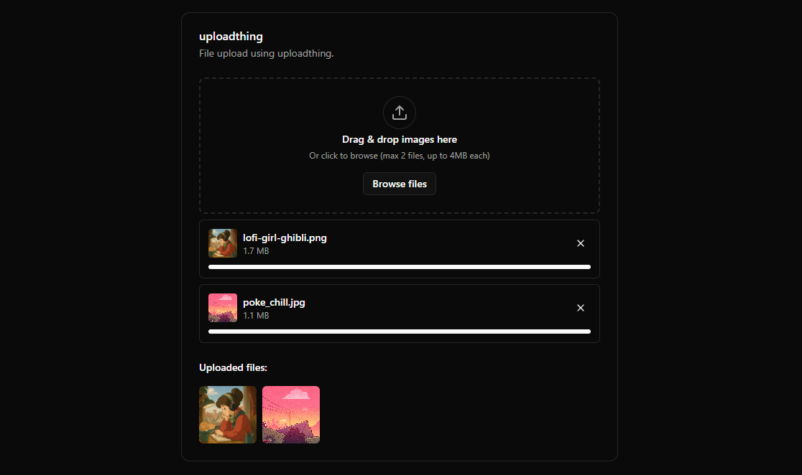

# [File Uploader](https://uploader.sadmn.com)

This is a file uploader built with `shadcn/ui`, and `react-dropzone`. It is bootstrapped with `create-t3-app`.

[](https://uploader.sadmn.com)

## Tech Stack

- **Framework:** [Next.js](https://nextjs.org)
- **Styling:** [Tailwind CSS](https://tailwindcss.com)
- **UI Components:** [shadcn/ui](https://ui.shadcn.com)
- **DND Uploader:** [react-dropzone](https://react-dropzone.js.org/)
- **Storage:** [uploadthing](https://uploadthing.com)
- **Validation:** [Zod](https://zod.dev)

## Features

- [x] Reusable `useFileUpload` hook for uploading files with `uploadthing`
- [x] Drag and drop file upload component with progress bar
- [x] React-hook-form integration with `shadnc/ui` form components
- [x] File dialog demo with adding and removing files from the scrollable list

## Running Locally

1. Clone the repository

   ```bash
   git clone https://github.com/sadmann7/file-uploader
   ```

2. Install dependencies using pnpm

   ```bash
   pnpm install
   ```

3. Copy the `.env.example` to `.env` and update the variables.

   ```bash
   cp .env.example .env
   ```

4. Start the development server

   ```bash
   pnpm run dev
   ```

## How do I deploy this?

Follow the deployment guides for [Vercel](https://create.t3.gg/en/deployment/vercel), [Netlify](https://create.t3.gg/en/deployment/netlify) and [Docker](https://create.t3.gg/en/deployment/docker) for more information.
